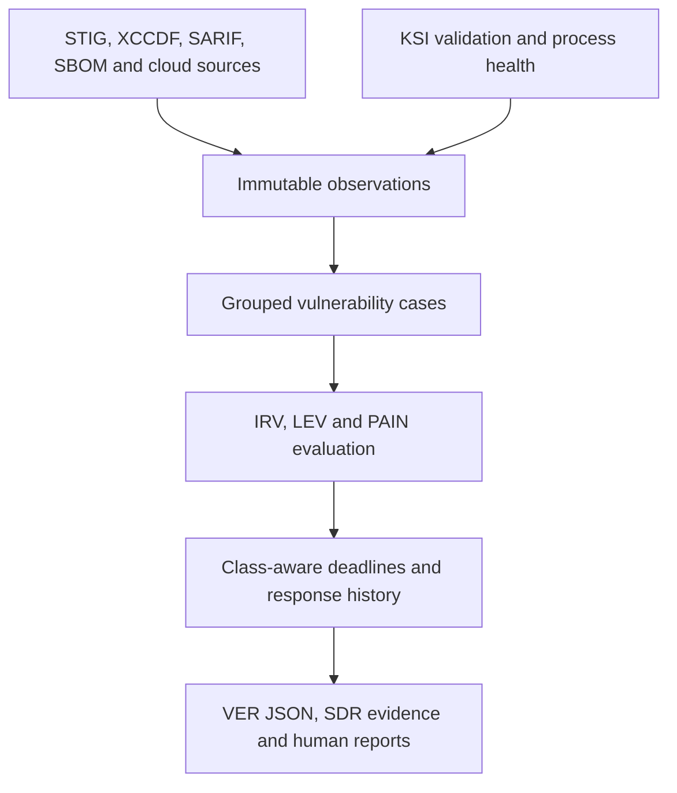

**A local-first evidence compiler for FedRAMP® 20x Vulnerability Detection and Response (VDR).**

ComplyRoll turns scanner observations, validation runs, and operational evidence into traceable
vulnerability cases, class-aware response clocks, and official-format FedRAMP reports that a
provider can publish and an independent assessor can recompute.

> **Project status (2026-08-22):** pre-alpha. Phase 0 (hardened ingestion) and Phase 1 are
> complete: `complyroll report vdt` compiles scanner artifacts into a schema-valid Vulnerability
> Detail Report, `complyroll validate` checks any report against the pinned official schemas, and
> the persisted path (`ingest`, `cases`, `report vdt --db`, `store verify`) records the same work
> as append-only history and rebuilds the report from it byte for byte. ComplyRoll does not
> produce a FedRAMP submission package and must not be represented as FedRAMP approved. PyPI
> carries pre-releases only (`pip install --pre complyroll`); the source checkout below is the
> development path.

## What runs today

| Surface | What it does |
|---|---|
| `complyroll report vdt ARTIFACT... --class C --package-uri URI --from T --to T [--evaluations FILE] [--detected-at T] [--as-of T] [--calendar-tz NAME] [-o FILE] [--markdown FILE]` | Compiles CKLB, CKL, XCCDF, and ARF files into an official-format Vulnerability Detail Report (`VER-RPT-VDT`): open findings grouped into vulnerabilities with stable tracking ids, class-aware deadlines with rule ids and force, overdue flags with explanations, and a Markdown twin rendered from the same records. Validated against the bundled official schema before anything is written |
| `complyroll ingest ARTIFACT... --db STORE [--as-of T] [--actor NAME]` | Records each artifact and its observations as typed events (`artifact.ingested`, `observation.recorded`) in an append-only SQLite store, validated against published contracts before they are written. Re-running over the same bytes appends nothing |
| `complyroll cases correlate\|attest-detection\|evaluate\|list\|history --db STORE` | Opens one case per vulnerability, records attested detection times and operator evaluations as events, lists cases, and prints one case's full history. A changed evaluation appends a second `case.evaluated` event; the earlier one stays readable |
| `complyroll report vdt --db STORE --class C --package-uri URI --from T --to T [--as-of T] [--calendar-tz NAME] [-o FILE] [--markdown FILE]` | Rebuilds the Vulnerability Detail Report from the event log through the same record compiler as the stateless path. The output is byte-identical to the stateless report for the same inputs, and that equality is a test |
| `complyroll store verify --db STORE` | Walks the whole log checking payload digests, sequence and stream-version contiguity, the sequence counter, and the schema definitions, then audits the domain (every payload against its published contract, every event against its stream kind and the artifact identity its stream names, every artifact stream for completeness in both directions and for repeated observation identifiers, every metadata envelope), and exits non-zero on any fault, including on files the normal open refuses |
| `complyroll validate REPORT --schema vulnerability-detail\|accepted-vulnerability\|historical-activity` | Validates a report against the pinned official schema, offline, printing JSON Pointers for every failure and the exact schema provenance |
| `stigroll <files> [--cci-list U_CCI_List.xml] [--format markdown\|csv\|json] [-o FILE]` | The predecessor STIG roll-up, rebuilt on the hardened adapters and locked to its original output byte-for-byte |
| `complyroll.adapters.ingest_stig_artifact(path)` | CKLB, CKL, XCCDF, and ARF files become immutable observations with artifact digest, parser identity, timestamps, and structured diagnostics |
| `complyroll.policy.load_bundled_policy(profile)` | Selects the 36 provider-facing VDR and VER rules for a 20x Class B or Class C profile from the pinned official dataset and calculates evaluation, PAIN response, and acceptance-threshold deadlines with full provenance, in the provider's calendar timezone |
| `complyroll.store.SQLiteEventStore` | Append-only event log with optimistic concurrency, payload digests, schema and tail-integrity verification, and projection checkpoints. Domain events are written only through `complyroll.events.EventRepository`, which validates every payload against a published contract (ADR 0008) |

The report compiler is stateless by design (ADR 0007): the same artifacts, evaluations, options,
and `--as-of` instant produce the same bytes, in any argument order, which is the property an
independent assessor is asked to test. Argument order is not a fact about the system under
assessment, so nothing derived from it reaches the report: the artifact manifest, the diagnostics,
and the members of a vulnerability that spans several files are all ordered by their own content.
The claim is about the compiled report and about the same set of files. The event log is
deliberately not order-independent, because an append-only log records what happened when. The persisted path (ADR 0008) records the same inputs as typed events and rebuilds
this same report from the log, so changing an evaluation creates history instead of overwriting
it. Accepted-vulnerability and historical-activity reports are the next slice. See
[`docs/BUILD_PLAN.md`](docs/BUILD_PLAN.md).

## Quick start

From a source checkout:

```bash
python3 -m venv .venv
.venv/bin/python -m pip install -e .
.venv/bin/python -m complyroll version
.venv/bin/python -m unittest discover -s tests -v
```

Compile the synthetic fixtures into a Vulnerability Detail Report and validate it:

```bash
complyroll report vdt \
  tests/fixtures/ubuntu-host.cklb \
  tests/fixtures/windows-host.ckl \
  tests/fixtures/openscap-results.xml \
  --class C \
  --package-uri https://example.test/cpo \
  --from 2026-08-01T00:00:00Z \
  --to 2026-08-31T23:59:59Z \
  --as-of 2026-08-21T12:00:00Z \
  --detected-at 2026-08-01T00:00:00Z \
  --evaluations examples/evaluations.json \
  -o report.json \
  --markdown report.md

complyroll validate report.json --schema vulnerability-detail
```

The fixtures declare no assessment timestamp, so `--detected-at` attests one; ComplyRoll never
substitutes file modification or ingestion time. `--evaluations` supplies the contextual judgement
a scanner cannot provide (IRV, LEV, PAIN, impact, rationale, evaluator; see
[`examples/evaluations.json`](examples/evaluations.json)). `--as-of` pins the instant overdue
flags are computed against, which makes the run reproducible byte for byte; the expected output
is [`tests/golden/vdt-fixtures.json`](tests/golden/vdt-fixtures.json) and
[`tests/golden/vdt-fixtures.md`](tests/golden/vdt-fixtures.md).

The report period selects contents: a vulnerability appears when it had activity inside
`--from`/`--to` (detection, evaluation, a PAIN reduction, or a planned reduction), or when it is
still undisposed and was detected on or before the period end. Every exclusion is reported as an
`excluded_by_period` diagnostic and counted in the document, so "nothing happened" is
distinguishable from "nothing was compiled". Output files are written all-or-nothing: a failed
Markdown write leaves no JSON behind, a failure while publishing restores the previous files, and a
rollback that itself fails names the files left in their new state and where their previous
content was kept.

Everything ComplyRoll adds beyond the official minimum structure lives under one `x-complyroll`
key: generator and parser versions, the rules dataset and schema commits and digests, the
compile diagnostics, every computed deadline with its rule and force, the grouped observation ids
and affected resources, the detection-time source (`artifact`, `artifact-partial`, or
`attestation`), and the evaluator and rationale. The JSON is the complete machine record; the
Markdown twin renders the same records for a reader, with a per-vulnerability detail section and
a parity test proving every identifier, deadline, and artifact it prints is in the JSON. That makes the document the provider's and assessor's working record.
It includes internal resource identifiers and provider rationale, so redact it before sharing
with an agency; audience-specific views are a later slice.

Record the same work as history, then rebuild the report from the log (ADR 0008):

```bash
complyroll ingest \
  tests/fixtures/ubuntu-host.cklb \
  tests/fixtures/windows-host.ckl \
  tests/fixtures/openscap-results.xml \
  --db complyroll.db \
  --as-of 2026-08-21T12:00:00Z

complyroll cases correlate --db complyroll.db

complyroll cases attest-detection \
  --db complyroll.db \
  --all-missing \
  --detected-at 2026-08-01T00:00:00Z \
  --rationale "The fixtures declare no assessment timestamp; the assessment ran on 1 August."

complyroll cases evaluate --db complyroll.db --evaluations examples/evaluations.json

complyroll report vdt \
  --db complyroll.db \
  --class C \
  --package-uri https://example.test/cpo \
  --from 2026-08-01T00:00:00Z \
  --to 2026-08-31T23:59:59Z \
  --as-of 2026-08-21T12:00:00Z \
  -o report-from-history.json \
  --markdown report-from-history.md

complyroll store verify --db complyroll.db
```

`report-from-history.json` and `.md` are byte-identical to `report.json` and `report.md` above:
both paths run one record compiler, and that equality is a test. Every write is idempotent, so
re-running any of those commands appends nothing. Change one PAIN rating in a copy of
`examples/evaluations.json`, run `cases evaluate` again with it, and
`complyroll cases history <tracking-id> --db complyroll.db` shows both evaluations while the
report carries the latest one. Nothing can update or delete an event; a correction is a new
event with its rationale, and `store verify` checks both the bytes (digests, contiguity, the
sequence counter, the schema) and the domain (every payload against its contract, every event
against its stream, every artifact stream complete, every metadata envelope well formed).

Roll up the synthetic fixtures with the predecessor command:

```bash
stigroll tests/fixtures/windows-host.ckl tests/fixtures/ubuntu-host.cklb --format json
```

Ingest an artifact and inspect its observations and diagnostics:

```python
from pathlib import Path

from complyroll.adapters import ingest_stig_artifact

result = ingest_stig_artifact(Path("assessment.cklb"))
if not result.successful:
    for diagnostic in result.errors:
        print(diagnostic.code, diagnostic.message)
else:
    print(result.observations[0].to_canonical_json())
```

Calculate a Class C response target with rule provenance:

```python
from datetime import UTC, datetime

from complyroll.models import PainRating
from complyroll.policy import CertificationClass, CertificationProfile, load_bundled_policy

policy = load_bundled_policy(CertificationProfile(CertificationClass.C))
deadline = policy.response_deadline(
    datetime(2026, 8, 21, 15, 0, tzinfo=UTC),
    pain=PainRating.N4,
    is_internet_reachable=True,
    is_likely_exploitable=True,
)
print(deadline.rule_id, deadline.force.value, deadline.due_at.isoformat())
print(deadline.provenance.commit, deadline.provenance.dataset_sha256)
```

Validate a report against the pinned official schema:

```python
from pathlib import Path

from complyroll.schemas import ReportSchema, validate_bundled_report_bytes

result = validate_bundled_report_bytes(
    ReportSchema.VULNERABILITY_DETAIL, Path("vulnerability-detail.json").read_bytes()
)
for issue in result.issues:
    print(issue.instance_pointer, issue.validator, issue.message)
print(result.provenance.schema_version, result.provenance.schema_sha256)
```

## Why this exists

FedRAMP 20x is based on measured outcomes and persistent validation. A failed STIG rule or CVE is
only a source observation. VDR additionally covers drift, failed validation pipelines, stale
security decisions, supply-chain exposures, and failures in the detection and response process
itself. ComplyRoll therefore separates immutable observations from stateful vulnerability cases.

Target pipeline (the stages after observations are not built yet):



## Non-negotiable rules

- Source severity, DISA CAT, CVSS, and PAIN are separate concepts.
- ComplyRoll must never infer PAIN solely from source severity or CVSS.
- A scanner pass may support a Key Security Indicator (KSI); it does not prove the complete KSI.
- Grouping observations must not destroy affected-resource or source-level details.
- Rule calculations must identify the exact pinned FedRAMP rules version used.
- Human-readable and machine-readable reports must come from the same normalized records.
- Historical evaluations and evidence must remain reproducible.

## For independent assessors

ComplyRoll is meant to be run cold on provider-supplied artifacts: ingest the raw scanner exports,
recompute the clocks and the report, and compare against what the provider published. Every
deadline names its rule identifier, force (MUST or SHOULD), certification class, dataset commit,
and digest. Assessors do not configure or operate ComplyRoll on a provider's behalf; under the
2026 recognition rules, advisory work on an offering bars assessing that offering for two years.

## Design documents

- [`docs/BUILD_PLAN.md`](docs/BUILD_PLAN.md): phased implementation plan and exit criteria
- [`docs/ARCHITECTURE.md`](docs/ARCHITECTURE.md): system boundaries and component design
- [`docs/DATA_MODEL.md`](docs/DATA_MODEL.md): observation, case, evaluation, and evidence model
- [`docs/FEDRAMP_2026_MAPPING.md`](docs/FEDRAMP_2026_MAPPING.md): current rule and schema mapping
- [`docs/SECURITY.md`](docs/SECURITY.md): threat model and evidence-handling requirements
- [`docs/decisions/`](docs/decisions/): architecture decision records 0001 through 0007
  (0007 fixes the report mappings: attested detection time, disposition table, clock semantics,
  overdue wording, the `x-complyroll` extension, and the evaluations file)
- [`examples/`](examples/): the fixture-to-report demo inputs
- [`AGENTS.md`](AGENTS.md): repository rules and development commands

## Dependencies and data

Persistence uses Python's standard-library SQLite binding. Report validation uses the
major-version-bounded `jsonschema` package with its non-GPL format extra, because the standard
library does not implement JSON Schema Draft 2020-12 (ADR 0006). Everything else is the standard
library.

The official FedRAMP rules dataset and VER schemas are bundled unmodified and pinned to immutable
upstream commits with SHA-256 digests; see [`NOTICE`](NOTICE) and
[`src/complyroll/data/README.md`](src/complyroll/data/README.md) for provenance and license.

Authoritative sources ComplyRoll consumes and pins rather than copies into constants:

- [FedRAMP Consolidated Rules for 2026](https://www.fedramp.gov/2026/)
- [FedRAMP machine-readable rules](https://github.com/FedRAMP/rules)
- [FedRAMP JSON schemas](https://github.com/FedRAMP/schemas)
- [Vulnerability Detection and Response](https://www.fedramp.gov/2026/reference/vulnerability-detection-and-response/)
- [Vulnerability Evaluation and Reporting](https://www.fedramp.gov/2026/reference/vulnerability-evaluation-and-reporting/)
- [Key Security Indicators](https://www.fedramp.gov/2026/reference/key-security-indicators/)

## Disclaimer

ComplyRoll is informational tooling, not legal or compliance advice. A report that validates
against an official schema satisfies that schema's minimum structure; it is not a FedRAMP
determination, and the provider remains responsible for meeting the Consolidated Rules. Verify
every clock against <https://www.fedramp.gov/2026/> before relying on it.

## License

ComplyRoll's code is licensed under the Apache License, Version 2.0 (see [`LICENSE`](LICENSE)
and [`NOTICE`](NOTICE)). The bundled FedRAMP data files are works of the U.S. Government and are
not covered by that license. The ComplyRoll name is not licensed (Apache License, Section 6).
Contributions require a Developer Certificate of Origin sign-off
([`CONTRIBUTING.md`](CONTRIBUTING.md)).

FedRAMP® is a registered trademark of the U.S. General Services Administration. ComplyRoll is an
independent project and is not affiliated with, endorsed by, or approved by GSA or the FedRAMP
Program Management Office.
