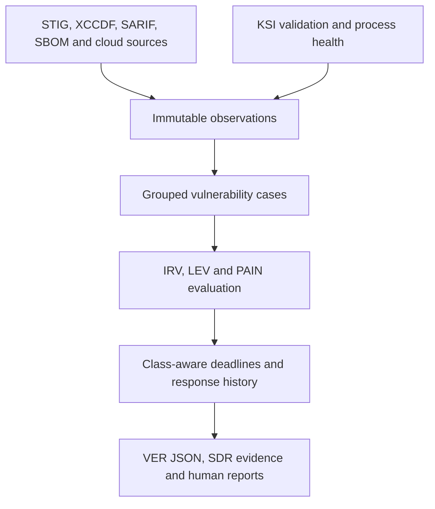

# ComplyRoll

**Evidence automation for continuous authorization.**

ComplyRoll is a local-first evidence compiler for FedRAMP 20x Vulnerability Detection and
Response (VDR).

It is intended to turn scanner observations, validation runs, and operational evidence into
traceable vulnerability cases, class-aware response timelines, and consistent human- and
machine-readable FedRAMP reports.

> **Project status:** Phase 0 ingestion kernel complete; Phase 1 is in progress with durable event
> history, class-aware policy selection, and verified offline report-schema validation implemented.
> ComplyRoll does not yet produce a FedRAMP submission package and must not be represented as
> FedRAMP approved.

## Product direction

ComplyRoll's initial product wedge is deliberately narrower than a full GRC platform:

1. Ingest heterogeneous security observations.
2. Preserve source evidence and provenance.
3. Group observations into stateful vulnerability cases without losing instance detail.
4. Capture internet reachability, likely exploitability, and Potential Agency Impact N-rating
   (PAIN) evaluations.
5. Calculate applicable Class B or Class C clocks from a pinned official rules version.
6. Generate schema-valid FedRAMP VER JSON and matching human-readable reports.
7. Detect failures in the detection and response process itself.

The existing [`stigroll`](https://github.com/ktalons/stigroll) project is the planned first
compatibility adapter. Its CKL, CKLB, XCCDF, and CCI mapping behavior will be preserved while
ComplyRoll introduces the broader VDR case model.

## Why this exists

FedRAMP 20x is based on measured outcomes and persistent validation. A failed STIG rule or CVE is
only a source observation. VDR additionally covers drift, failed validation pipelines, stale
security decisions, supply-chain exposures, process failures, and other weaknesses.

ComplyRoll therefore separates immutable observations from vulnerability cases:



## Non-negotiable rules

- Source severity, DISA CAT, CVSS, and PAIN are separate concepts.
- ComplyRoll must never infer PAIN solely from source severity or CVSS.
- A scanner pass may support a Key Security Indicator (KSI); it does not prove the complete KSI.
- Grouping observations must not destroy affected-resource or source-level details.
- Rule calculations must identify the exact pinned FedRAMP rules version used.
- Human-readable and machine-readable reports must come from the same normalized records.
- Historical evaluations and evidence must remain reproducible.

## Repository guide

- [`docs/BUILD_PLAN.md`](docs/BUILD_PLAN.md) — phased implementation plan and exit criteria
- [`docs/ARCHITECTURE.md`](docs/ARCHITECTURE.md) — system boundaries and component design
- [`docs/DATA_MODEL.md`](docs/DATA_MODEL.md) — observation, case, evaluation, and evidence model
- [`docs/FEDRAMP_2026_MAPPING.md`](docs/FEDRAMP_2026_MAPPING.md) — current rule and schema mapping
- [`docs/SECURITY.md`](docs/SECURITY.md) — threat model and evidence-handling requirements
- [`docs/decisions/0001-observation-case-separation.md`](docs/decisions/0001-observation-case-separation.md)
  — first architecture decision record
- [`docs/decisions/0002-artifact-bound-observation-identity.md`](docs/decisions/0002-artifact-bound-observation-identity.md)
  — Phase 0 identity and idempotency decision
- [`docs/decisions/0003-bounded-standard-library-ingestion.md`](docs/decisions/0003-bounded-standard-library-ingestion.md)
  — Phase 0 input-hardening decision
- [`docs/decisions/0004-append-only-sqlite-event-store.md`](docs/decisions/0004-append-only-sqlite-event-store.md)
  — Phase 1 event-history and projection decision
- [`docs/decisions/0005-select-policy-from-verified-fedramp-rules.md`](docs/decisions/0005-select-policy-from-verified-fedramp-rules.md)
  — Phase 1 class-aware policy selection and deadline decision
- [`docs/decisions/0006-verify-and-resolve-official-ver-schemas-offline.md`](docs/decisions/0006-verify-and-resolve-official-ver-schemas-offline.md)
  — Phase 1 official VER schema verification and offline resolution decision

## Current capabilities

Phase 0 provides:

- Hardened CKLB, CKL, XCCDF/ARF, and CCI ingestion adapters.
- Immutable observations with source SHA-256, parser identity/version, ingest time, resource,
  source identifiers, and structured diagnostics.
- Stable observation IDs that make reimporting identical artifact bytes with the same parser
  version idempotent.
- Bounded JSON/XML input handling with DTD/entity rejection and explicit failed-ingest results.
- Canonical observation JSON serialization.
- A pinned manifest for the official FedRAMP rules dataset and schema.
- A backward-compatible `stigroll` command and source-checkout `stigroll.py` launcher.

Phase 1 currently adds:

- A migration-managed SQLite event log with append-only update/delete guards.
- Transactional batch appends with optimistic per-stream versions and unique event identifiers.
- Canonical, bounded JSON payloads with SHA-256 integrity checks and explicit payload-schema
  versions.
- Ordered global replay and compare-and-swap projection checkpoints that can reset for rebuilds.
- An offline, digest-verified copy of the pinned official FedRAMP rules dataset.
- Provider-facing 20x Class B and Class C VDR/VER selection using official applicability data.
- Provenance-bearing evaluation, response, reporting, and acceptance-threshold deadlines derived
  from structured source timeframes and PAIN matrices.
- A digest-verified offline registry for the official Common Definitions, Vulnerability Detail,
  Accepted Vulnerability, and Historical VER Activity schemas.
- Draft 2020-12 report validation with format checks, actionable JSON Pointers, and exact schema
  provenance.

The original command remains available from a source checkout:

```bash
python3 stigroll.py assessment.cklb --cci-list U_CCI_List.xml
python3 stigroll.py legacy.ckl results.xml --format json
```

After installation, the same behavior is exposed as `stigroll`. The ComplyRoll planning CLI remains:

```bash
python3 -m complyroll version
python3 -m complyroll plan
```

The hardened adapter API returns observations and diagnostics separately:

```python
from pathlib import Path

from complyroll.adapters import ingest_stig_artifact

result = ingest_stig_artifact(Path("assessment.cklb"))
if not result.successful:
    for diagnostic in result.errors:
        print(diagnostic.code, diagnostic.message)
else:
    print(result.observations[0].to_canonical_json())
```

From a source checkout:

```bash
python3 -m venv .venv
.venv/bin/python -m pip install -e .
.venv/bin/python -m complyroll version
.venv/bin/python -m unittest discover -s tests -v
```

Phase 1 persistence uses Python's standard-library SQLite binding. Official report validation uses
the major-version-bounded `jsonschema` package with its non-GPL format extra because Python's
standard library does not implement JSON Schema Draft 2020-12. Schema retrieval remains offline;
the dependency decision and security boundary are recorded in ADR 0006. Case correlation and API
support will be added intentionally as their slices begin. Development and test commands are
documented in [`AGENTS.md`](AGENTS.md).

## Authoritative sources

ComplyRoll will consume and pin, rather than copy into application constants:

- [FedRAMP Consolidated Rules for 2026](https://www.fedramp.gov/2026/)
- [FedRAMP machine-readable rules](https://github.com/FedRAMP/rules)
- [Vulnerability Detection and Response](https://www.fedramp.gov/2026/reference/vulnerability-detection-and-response/)
- [Vulnerability Evaluation and Reporting](https://www.fedramp.gov/2026/reference/vulnerability-evaluation-and-reporting/)
- [Key Security Indicators](https://www.fedramp.gov/2026/reference/key-security-indicators/)

## License and status

MIT licensed. ComplyRoll is an independent open-source project and is not affiliated with,
endorsed by, or approved by GSA or FedRAMP.
