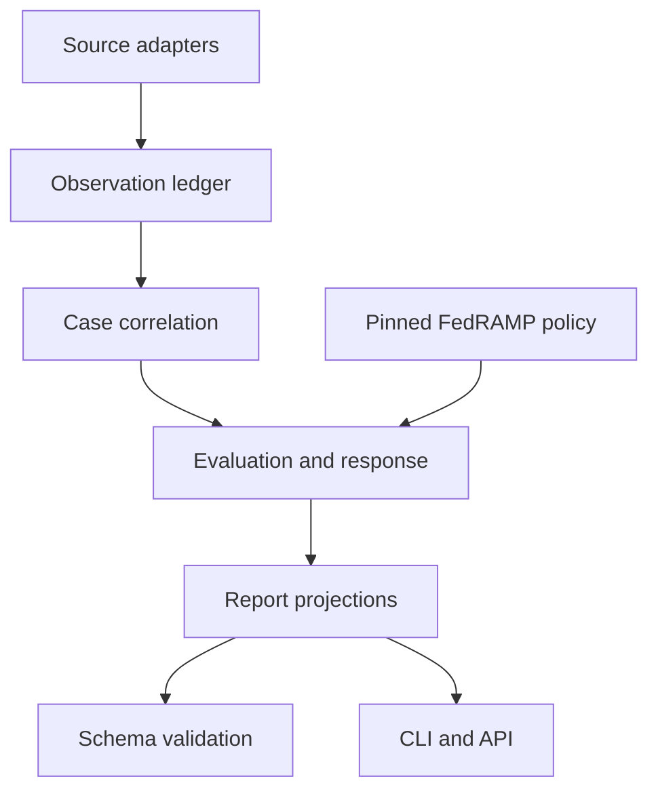

# Architecture

## Design center

ComplyRoll is an evidence compiler, not the source of security truth. It consumes source facts,
preserves them, records human or automated evaluations, applies a versioned policy, and produces
projections for specific consumers.

## Logical components



### Source adapters

Adapters parse a source artifact or event and return normalized observations plus diagnostics.
They do not assign PAIN, accept risk, calculate compliance, or mutate cases.

Initial adapters:

- CKLB
- CKL
- XCCDF/ARF
- CCI mapping

Planned adapters:

- SARIF
- CycloneDX/SPDX
- CISA KEV
- Cloud, container, and CSPM sources
- Change and deployment events
- KSI validation runs

### Observation ledger

Observations are immutable. The ledger stores the normalized record, original source identifier,
artifact digest, ingest diagnostics, parser version, and timestamps. Reingestion must be
idempotent.

Phase 0 implements this contract before persistence: an `IngestResult` contains immutable
`ArtifactProvenance`, `Observation`, and `IngestDiagnostic` records. SQLite persistence begins in
Phase 1.

### Case correlation

Correlation groups observations that represent one logical weakness. Grouping is reversible and
must retain all observation-to-resource links. Initial grouping should be deterministic and
explainable; manual split and merge events are preserved.

### Evaluation and response

This layer records contextual decisions rather than hiding them inside a numeric score:

- Internet reachable or not
- Likely exploitable or not
- PAIN N1–N5
- False-positive analysis
- Evaluation rationale
- Mitigation/remediation plan and actions
- Rating reductions
- Acceptance rationale

It uses policy records selected from a pinned FedRAMP rules dataset to calculate clocks.

### Policy source

The official `FedRAMP/rules` structured JSON is canonical. A policy snapshot records:

- Upstream repository URL
- Git commit or immutable release identifier
- Content digest
- Retrieval time
- FedRAMP effective dates
- Referenced schema URLs and digests
- Selected certification type, class, and path

Policy code translates the canonical source into evaluated constraints; it does not maintain a
second hand-written deadline table.

The Phase 1 policy loader bundles the manifest-pinned official dataset for offline use, verifies
its exact digest and metadata before parsing, and then selects provider-facing VDR and VER rules
using the source subset's type, path, class, and affected-party applicability. Class-specific force,
timeframes, and PAIN matrices are resolved directly from `varies_by_class`. Calculated deadlines
retain the rule ID, profile, source commit, dataset version, last-updated value, and SHA-256.

Missing structured timeframes remain unknown. Policy code does not extract numbers from prose,
invent KEV deadlines, or calculate business days without an explicit calendar.

### Report projections

Reports are disposable projections over durable events and normalized records. Human-readable
and machine-readable reports are rendered from the same projection to prevent drift. The record
compiler builds one period-agnostic record set from either entry path, and three projections
read it: the detail report, the accepted-vulnerability report, and the historical snapshot
(ADR 0010). Period selection happens in a projection, never in the set, so a diagnostic raised
at ingest or rebuild sits at the same position in every report.

Shipped projections:

- Vulnerability Detail Report
- Accepted Vulnerability Information
- Historical VER Activity

Next projections:

- Operational deadline view
- Human-readable monthly activity report

Later projections:

- Security Decision Record
- Ongoing Certification Report
- Trust-center API resources

### Schema validation

The initial Phase 1 validator bundles the official FedRAMP Common Definitions, Vulnerability
Detail, Accepted Vulnerability, and Historical VER Activity schemas from one immutable
`FedRAMP/schemas` commit. A manifest pins every `$id`, `$schemaVersion`, and SHA-256. Loading rejects
digest or metadata drift before building a Draft 2020-12 registry.

Only verified bundled resources are registered. Every `$ref` is resolved during bundle loading,
and the registry has no remote retrieval callback. Report validation therefore works offline and
fails closed if a required document or fragment is absent. Validation results contain exact source
provenance and sorted issues with instance and schema JSON Pointers.

The official schemas intentionally allow provider extensions. ComplyRoll preserves that behavior;
additional semantic checks such as report-period ordering and projection reconciliation belong to
the report compiler rather than an altered copy of the official schema.

## Storage direction

The MVP uses SQLite because it provides transactions, constraints, portability, and standard
local tooling without forcing hosted infrastructure. The domain layer must not import SQLite
types directly.

Use an append-only event table for material changes and rebuildable projection tables for common
queries. Evidence bodies should use content-addressed storage rather than being duplicated in
case rows.

Schema version 1 implements this boundary in `complyroll.store`. Each event has a global sequence,
unique event ID, stream ID and version, event type and payload-schema version, occurrence and
recording timestamps, canonical JSON payload and metadata, and a payload SHA-256. Appends use an
expected stream version and one `BEGIN IMMEDIATE` transaction. SQLite constraints reject duplicate
event IDs and stream versions, while triggers reject event updates and deletions.

Projection checkpoints are mutable compare-and-swap cursors over the global sequence. Projection
rows remain disposable and must be rebuildable from sequence zero. Concrete projection handlers
will own their query tables and must update those rows and their checkpoint in one transaction.

Event types with published version-1 contracts (ADR 0008): `artifact.ingested`,
`observation.recorded`, `case.created`, `case.observation_linked`, `detection.attested`,
`case.evaluated`, `case.pain_reduced`, `case.disposition_recorded`, `case.identified`.
Candidates for later slices: `case.action_planned`, `case.action_completed`,
`validation.completed`, `evidence.attached`.

## Package layout

```text
src/complyroll/
  adapters/       # Phase 0 adapter contracts, safe parsing, and STIG/XCCDF/CCI implementations
  compat/         # predecessor-compatible stigroll CLI and renderers
  correlation/    # correlation v0: open observations grouped into vulnerabilities (ADR 0007)
  data/           # bundled immutable source manifests, rules, and official schemas
  events/         # typed event contracts (JSON Schemas), stream ids, and the validating repository (ADR 0008)
  history/        # the fold: rehydrated observations, case state, history listings, idempotent writers
  policy/         # verified rule source, class-aware selection, and deadlines
  reports/        # the record compiler, the stateless and replayed report paths, the evaluations file
  schemas/        # verified offline schema registry and report validation results
  store/          # SQLite event history, migrations, integrity, and projection checkpoints
  cli.py          # ComplyRoll project CLI (ingest, cases, report vdt|avi|historical, store verify, validate, version, plan)
  models.py       # framework-independent domain records
```

The report compiler has two entry paths that share one record compiler (ADR 0007, ADR 0008,
ADR 0010).
The stateless path is a pure function of artifacts, an evaluations file, and explicit package
options. The persisted path reads `observation.recorded` payloads back into observations, folds
each case stream into its current state (attestation, every evaluation in order, reductions,
disposition, identifier override), and hands the result to the same compiler, so the rebuilt
report is byte-identical to the stateless one for the same inputs; that equality is the
slice's acceptance test and stays a regression test. ADR 0010 splits that compiler into a
period-agnostic record set and three projections, so the same equality holds for the
accepted-vulnerability and historical reports, each golden-tested on both paths. Event payloads
are validated against the contracts in `events/` on every append; the store itself stays a
generic envelope log. The fold runs in memory at Phase 1 volumes; projection tables and
checkpoints remain available for when that stops being enough. The domain model remains
independent from all of it.

## Failure semantics

- Parse failure: diagnostic plus failed ingest; never a clean result.
- Missing expected resource: coverage observation.
- Stale scanner/validation: process-health observation.
- Policy unavailable or unverified: block deadline/report certification claims.
- Schema mismatch: report generation failure with actionable paths.
- Unknown evaluation factor: preserve unknown; do not invent a default.

An absent source observation timestamp is represented as `None` plus a warning diagnostic. File
modification or ingestion time is not silently substituted for a scanner-declared timestamp.
